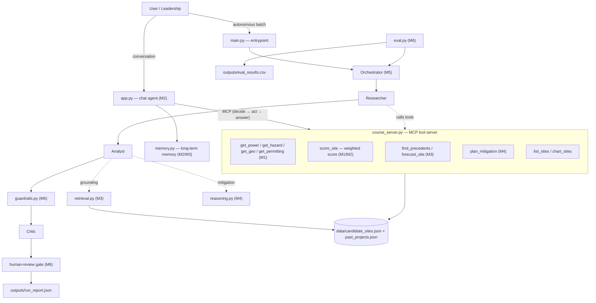

# Data-Center Site Forecaster — an autonomous agent (CSCI 599 capstone)

A local, autonomous agent that helps a cloud provider's leadership decide **where
to build the next data-center site**. It scores candidate sites, forecasts a
realistic build timeline, grounds that forecast in comparable past builds, plans
the top-risk mitigation, and ranks the shortlist — with guardrails and a
human-review gate before anything ships.

It runs entirely on your laptop. No API keys, no cloud, no cost. The language
model is a local Ollama model; the tools, retrieval, reasoning, guardrails, and
evaluation are plain Python you can read and test.

> All site and project data in this repo is **synthetic**. The locations mirror
> real Azure region geographies, but every number is invented for the demo.

## The problem and the user

Choosing a data-center site means weighing power cost and grid queues, natural
hazards, network latency, permitting, and water — and then being honest about how
long the build will actually take. That analysis is slow, easy to get wrong, and
the timeline half is usually optimistic. The **intended user is the leadership
team** (executive decision-makers) who need a defensible, ranked recommendation
plus the one risk to fix first.

## What it does

- Pulls each site's power, hazard, connectivity, and permitting profile through tools.
- Computes a deterministic weighted score from **leadership priorities** you set.
- **Grounds** the forecast in comparable past builds (retrieval), which can move the score, add months to the timeline, and raise the risk tier — every adjustment cited.
- Explores **2-3 mitigation strategies** for the top risk and recommends the best (Tree-of-Thoughts).
- Coordinates the work across **Researcher / Analyst / Critic** agents.
- Enforces **guardrails** (an unearned "Strong" is downgraded, a failed source is flagged) and escalates high-capital calls to a **human**.
- Runs autonomously across every site and writes a machine-readable report.

## Architecture



### How the modules map to the code

| Module | Concept | File(s) |
|---|---|---|
| M1 | Goal, user, leadership priorities, tools | `config.py`, `course_server.py` (data tools) |
| M2 | Reasoning loop + memory | `agent.py`, `memory.py` |
| M3 | Retrieval grounding (RAG) | `retrieval.py`, `forecast_site`/`find_precedents` |
| M4 | Advanced reasoning (Tree-of-Thoughts) | `reasoning.py`, `plan_mitigation` |
| M5 | Multi-agent coordination | `agents.py` (Researcher/Analyst/Critic/Orchestrator) |
| M6 | Guardrails, human oversight, evaluation | `guardrails.py`, `agents.py` (review gate), `eval.py` |

## Setup

The interactive chat (`app.py`) needs a local LLM via Ollama. The autonomous
pipeline (`main.py`) and the evaluation (`eval.py`) are deterministic and run
**without** any model.

**1. Install [Ollama](https://ollama.com/download), then pull the two models:**

```bash
ollama pull gemma3:4b
ollama pull nomic-embed-text
```

**2. Create an environment and install dependencies (run from `AgentDemo/`):**

```bash
cd AgentDemo
python -m venv .venv && source .venv/bin/activate     # Windows: .venv\Scripts\activate
pip install -r requirements.txt
```

**3. (Optional) confirm the setup:**

```bash
python setup_check.py
```

## Running it

All commands run from `AgentDemo/`.

```bash
python main.py            # autonomous: rank every site, gate the risky ones, write the report
python main.py --no-input # unattended: flagged sites are left "pending"
python eval.py            # run the behavior checks, write outputs/eval_results.csv
python agents.py          # multi-agent demo: one site with a simulated source failure + the sweep
python app.py             # interactive chat (needs Ollama); opens http://127.0.0.1:7860
```

In the chat, try: `list all the sites`, `score Quincy`, `forecast Quincy`,
`any comparable past builds for San Antonio?`, `how do we de-risk Phoenix?`.
Watch the Trace panel to see the tool calls, the retrieved precedent, and the
guardrail decisions.

## Sample output (`python main.py`)

```
Ranked shortlist (6 sites):
  1. San Antonio, TX - South Central US expansion (site-b): 73.5/100, Medium risk, critic REVIEW -- Strong candidate  <REVIEW>
  2. Phoenix, AZ - West US 3 expansion (site-d): 55.2/100, High risk, critic REVIEW -- Conditional ...
  3. Columbus, OH - Central US expansion (site-a): 51.4/100, High risk, critic APPROVE -- Weak / deprioritize
  ...
Top site: San Antonio, TX -- 73.5/100, Strong candidate (decision: pending).
```

The grounding is the thing to watch. For Quincy, two comparable builds that
overran on grid energization pull the forecast from **59.3 to 39.3**, add
**14 months**, raise risk **Medium → High**, and flip the recommendation to
"Weak". For San Antonio, the one comparable build that came in on time clears
the similarity threshold while weak cross-region matches do not, so it keeps its
**73.5 "Strong"** score.

## Evaluation

`eval.py` runs nine deterministic behavior checks spanning M1-M6 (grounding
changes a decision, the threshold blocks a false analogy, a source failure is
flagged, a guardrail downgrades an unsupported "Strong", a high-capital call is
escalated, the ranking is deterministic, and so on). Latest run: **9 / 9 passed.**
Full write-up with strengths and limitations is in
[`outputs/EVALUATION.md`](AgentDemo/outputs/EVALUATION.md).

## Safety, reliability, and human oversight

Guardrails are enforced in code, not just requested in a prompt. An unearned
"Strong" (ungrounded, high-risk, or built on a failed source) is downgraded
automatically with the reason recorded. A failed data source is flagged and
retried, never silently treated as safe. Invalid leadership weights are rejected
before a run. Any high-capital recommendation is escalated to a human, who
approves or holds it before it ships. The Critic (soft, judgement) and the
guardrails (hard rules) are deliberately separate roles.

## Repository layout

```
cmu-local-agent-demo/
├── README.md                  # this file
├── Capstone_2Day_Plan.xlsx    # build plan / rubric coverage / demo flow
└── AgentDemo/
    ├── app.py                 # interactive chat UI (Gradio + Ollama)
    ├── agent.py               # the reasoning loop (M2)
    ├── course_server.py       # MCP tool server: data + scoring + forecast + mitigation
    ├── retrieval.py           # RAG precedent grounding (M3)
    ├── reasoning.py           # Tree-of-Thoughts mitigation (M4)
    ├── agents.py              # Researcher / Analyst / Critic / Orchestrator (M5)
    ├── guardrails.py          # guardrails + escalation (M6)
    ├── main.py                # autonomous entrypoint
    ├── eval.py                # evaluation harness (M6)
    ├── memory.py              # long-term semantic memory
    ├── config.py              # goal, intended user, leadership weights
    ├── data/                  # candidate_sites.json, past_projects.json (synthetic)
    └── outputs/               # run_report.json, eval_results.csv, EVALUATION.md
```

## Limitations and next steps

The corpus is small and synthetic, so retrieval thresholds are tuned to it and
the default retriever is lexical (flip `USE_EMBEDDINGS` in `retrieval.py` for
semantic search). Scoring, mitigation utilities, and guardrail thresholds are
hand-set heuristics rather than learned. The evaluation tests behavior, not
predictive accuracy, which would need real outcome data to backtest. See
[`outputs/EVALUATION.md`](AgentDemo/outputs/EVALUATION.md) for the full list.
